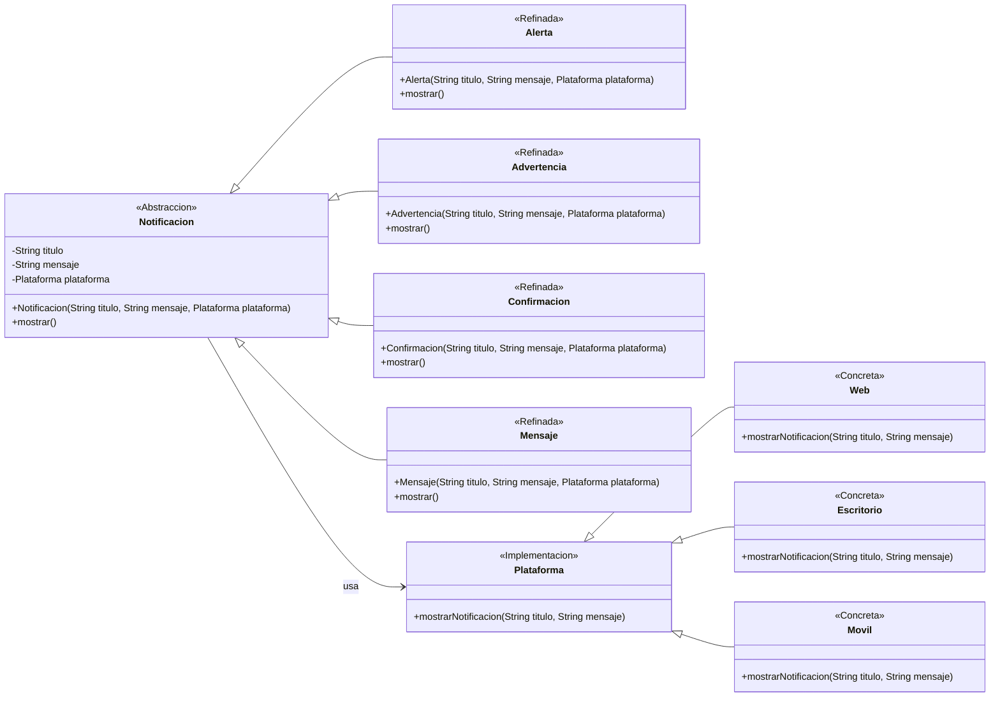

# Taller Patrones
## Integrantes del Proyecto
| Nombre | Correo Electrónico |
|---|---|
| Valentina Alejandra López Romero | valentinalopro@unisabana.edu.co |
| Mariana Valle Moreno | marianavamo@unisabana.edu.co |
| Laura Camila Rodriguez Leon | laurarodleo@unisabana.edu.co |

## Estructura de la Documentación
- [1. Escenario 1](#1-escenario-1)
- [2. Escenario 2](#2-escenario-2)
- [3. Escenario 3](#3-escenario-3)
- [4. Referencias](#4-referencias)

---
## 1. Escenario 1

En el Escenario 1 se plantea el desarrollo de una aplicación para una compañía automotriz que permite a los clientes personalizar y ordenar un automóvil. El objetivo principal es ofrecer múltiples configuraciones opcionales como: tipo de motor, color, llantas, interiores, techo solar o GPS. Sin necesidad de utilizar constructores con demasiados parámetros ni utilizar multiples constructores.

Para resolver este problema se seleccionó el patrón creacional Builder, ya que permite la construcción de objetos complejos mediante un proceso estructurado y progresivo, separando la lógica de construcción de la representación final del objeto. Este patrón resulta especialmente útil cuando un objeto debe configurarse en varias etapas o, como en este caso, cuando pueden existir múltiples variantes de configuración para un mismo tipo de objeto.

### Principales beneficios:
- Evita la acumulación de constructores extensos.
- Aumenta la flexibilidad al permitir la creación de distintas configuraciones sin modificar la clase principal.
- Mejora la escalabilidad del sistema, permitiendo agregar nuevos tipos de automóviles o componentes sin alterar la estructura central del código.
- Facilita la separación de responsabilidades, manteniendo un código más claro, flexible y mantenible.

### Diagrama de clases adaptado a la solución:

---
## 2. Escenario 2

En el Escenario 2 se presenta el desarollo de una aplicación para la cual se gestionen diferentes visualizaciones de notificaciones (y sus distintos tipos) según la plataforma, mostrando como problemática el manejo y creación de clases que se preseta con una herencia tradicional. Teniendo en cuenta lo anterior, se decide como objetivo el separar la lógica de las notificaciones y el medio de visualización, para así poder agregar más plataformas y/o tipos de notificaciones sin alterar todo el código. Para la solución, el patrón escogido fue el patrón Bridge.

Como solución se optó este patrón gracias a que este permite separar la abstracción (los distintos tipos de notificación) de la implementación (las plataformas en que se muestran). Así, ambos elementos evolucionan de forma independiente: es posible añadir nuevas plataformas sin modificar los tipos de notificación y viceversa.

### Principales beneficios:

* **Separación de responsabilidades:** cada jerarquía se desarrolla de manera independiente (tipos de notificación y plataformas de visualización).
* **Escalabilidad:** es posible agregar una nueva plataforma o un nuevo tipo de notificación sin requerir modificar clases ya existentes.
* **Reducción de clases:** se evita la multiplicación de subclases por cada combinación posible.
* **Mantenibilidad:** la estructura se mantiene limpia, entendible y adaptable.

### Diagrama de clases adaptado a la solución:

---
## 3. Escenario 3

En el Escenario 3 se requiere desarrollar una aplicación de chat grupal donde los usuarios pueden enviarse mensajes. El **problema central** es la **alta dependencia** que surge cuando cada usuario debe conocer y comunicarse con todos los demás, resultando en un sistema difícil de escalar y mantener.

Para resolver este problema, se seleccionó el **patrón de comportamiento Mediator (Mediador)**, ya que su propósito es reducir las dependencias caóticas entre objetos. El patrón introduce un objeto central (`ChatRoom`) que actúa como un **mediador**, forzando a los usuarios (`User`) a colaborar únicamente a través de él, nunca directamente entre sí.

### Principales beneficios:

* **Bajo Acoplamiento:** Los usuarios solo dependen del mediador (una abstracción), no de otros usuarios concretos.
* **Mantenimiento Simplificado:** La lógica de comunicación (la distribución de mensajes) está centralizada en la clase `ChatRoom`, no dispersa en múltiples objetos.
* **Escalabilidad:** Añadir o eliminar un usuario solo requiere modificar la lista del Mediador, cumpliendo con los principios **SOLID** como el Principio Abierto/Cerrado.

*(Para un análisis detallado de la implementación en Java y su relación con los principios SOLID, consulte el archivo `Ejercicio_3_Mediator/README.md`.)*

### Diagrama de clases adaptado a la solución:

---

## 4. Referencias
[1] Refactoring Guru, "Builder" [En línea]. Disponible: https://refactoring.guru/es/design-patterns/builder. [Accedido: Sep. 2025].

[2] O. Blancarte, "Builder" Reactive Programming, [En línea]. Disponible: https://reactiveprogramming.io/blog/es/patrones-de-diseno/builder. [Accedido: Sep. 2025].

[3] Refactoring Guru, "Mediator" [En línea]. Disponible: https://refactoring.guru/es/design-patterns/mediator. [Accedido: Sep. 2025].

[4] Refactoring Guru, "Bridge" [En línea]. Disponible: https://refactoring.guru/es/design-patterns/bridge
. [Accedido: Sep. 2025].

[5] Reactive Programming, "Patrón de diseño Bridge" [En línea]. Disponible: https://reactiveprogramming.io/blog/es/patrones-de-diseno/bridge
. [Accedido: Sep. 2025].

[6] DigitalOcean, "Bridge Design Pattern in Java" [En línea]. Disponible: https://www.digitalocean.com/community/tutorials/bridge-design-pattern-java
. [Accedido: Sep. 2025].

---

